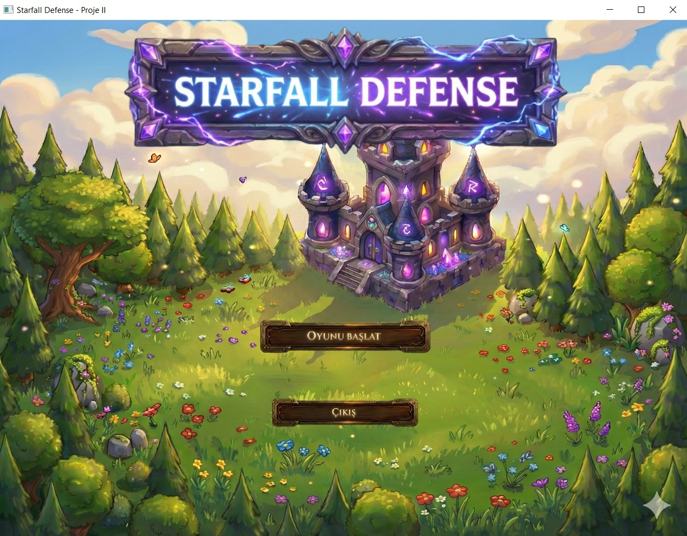

# Starfall Defense 🏰⚡

**Starfall Defense** is a strategic Tower Defense game developed with **Java** and **JavaFX**. The game challenges players to defend their castle against waves of mythical enemies using elemental towers.

## 🎮 Game Overview

In a world where a fallen star has split into three elemental powers—**Fire, Lightning, and Ice**—you must act as the Guardian. Dark forces, including Wizards, Knights, and Witches, are trying to steal the star's essence. Build towers, manage your resources, and stop them before they reach the castle!

## ✨ Key Features

* **Diverse Enemies (Polymorphism):**
    * 🧙‍♂️ **Wizard:** Balanced speed and health.
    * 🛡️ **Knight:** Highly armored, takes reduced damage but moves slowly.
    * 🧹 **Witch:** Very fast, resistant to ground-based traps.
* **Elemental Towers:**
    * ⚡ **Lightning Tower:** Single-target high damage, ignores some armor.
    * 🔥 **Fire Tower:** Deals **Area of Effect (Splash)** damage to groups of enemies.
    * ❄️ **Ice Tower:** Slows down enemies, reducing their movement speed by 50%.
* **Wave System:** Dynamic waves with increasing difficulty.
* **Pathfinding:** Enemies follow a predefined coordinate-based path using vector mathematics.
* **Save/Load System:** A custom `Logger` class records every event (enemy spawn, death, damage) to a `.txt` file with timestamps.
* **Rich UI:** Animated story intro, main menu, and real-time HUD (Heads-Up Display).

## 🛠️ Technologies Used

* **Language:** Java (JDK 21)
* **GUI Framework:** JavaFX
* **Concepts:** OOP (Inheritance, Polymorphism, Encapsulation), File I/O, AnimationTimer, Event Handling.
* **IDE:** NetBeans

## 🚀 How to Run

1.  **Clone the repository:**
    ```bash
    git clone [https://github.com/YOUR_USERNAME/StarfallDefense.git](https://github.com/YOUR_USERNAME/StarfallDefense.git)
    ```
2.  **Open in IDE:**
    * Open the project in **NetBeans** or **IntelliJ IDEA**.
    * Ensure JavaFX libraries are correctly configured in your path.
3.  **Run:**
    * Locate `StarfallDefense.java` in the `src` folder and run the file.

## 📷 Screenshots




## 👥 Contributors

* **[Erva Alacan]**  *
* **[Nisa Nur Yağlı]** *

---
*This project was developed as a semester project for the Computer Engineering department.*